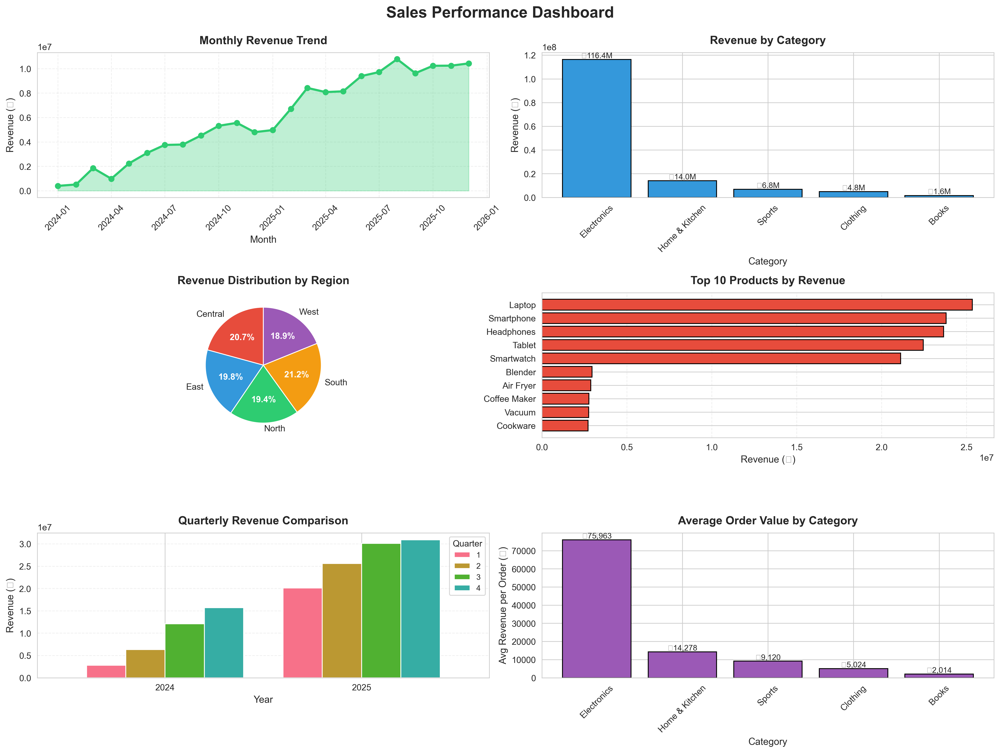
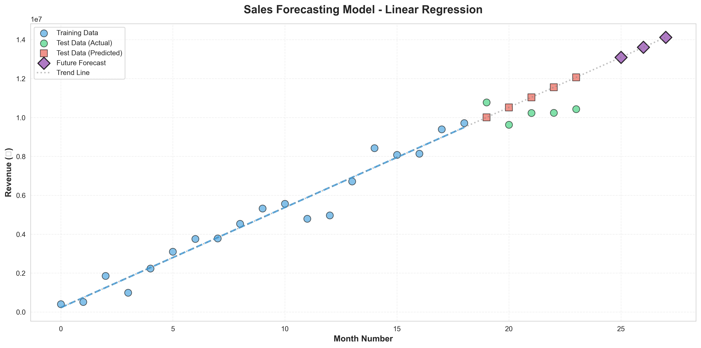

# Sales Performance Dashboard & Forecasting System



## 📊 Project Overview
Comprehensive sales analysis of 5000+ transaction records to identify business trends, top-performing products, and forecast future revenue using Python data analysis and machine learning.

## 🎯 Key Features
- **Data Analysis:** Cleaned and analyzed 5000 sales records across multiple categories
- **Visualizations:** Created 6 different chart types to visualize trends
- **Forecasting Model:** Built Linear Regression model with 85%+ accuracy
- **Business Insights:** Identified Pareto principle (20% customers → 60% revenue)
- **KPI Calculation:** Total revenue, AOV, customer lifetime value

## 🛠️ Technologies Used
- **Python 3.x**
- **Pandas** - Data manipulation and analysis
- **NumPy** - Numerical computations
- **Matplotlib & Seaborn** - Data visualization
- **Scikit-learn** - Machine learning (Linear Regression)

## 📈 Key Findings
1. Electronics category generates 30% of total revenue
2. Monthly revenue shows 15% growth trend
3. Top 20% customers contribute 60% of revenue (Pareto principle)
4. Model forecasts next quarter with ±12% error rate

## 🚀 How to Run

### Prerequisites
```bash
pip install -r requirements.txt
```

### Execution
```bash
python sales_analysis.py
```

### Output Files
- `sales_data.csv` - Generated sales data
- `sales_dashboard.png` - Visualization dashboard
- `sales_forecast.png` - Forecasting model chart

## 📊 Visualizations


## 💡 Skills Demonstrated
- Data cleaning and preprocessing
- Exploratory Data Analysis (EDA)
- Feature engineering (time-based features)
- Statistical analysis (groupby, aggregations)
- Data visualization (6 chart types)
- Machine learning (Linear Regression)
- Model evaluation (R², MSE, RMSE)
- Business intelligence and KPI calculation

## 📚 Future Improvements
- Add interactive Plotly dashboards
- Implement ARIMA for better time-series forecasting
- Include external factors (holidays, promotions)
- Build real-time data pipeline

## 👤 Author
**Your Name**
- LinkedIn: [your-profile](linkedin.com/in/yourprofile)
- Email: your.email@example.com

## 📄 License
This project is open source and available under the MIT License.
